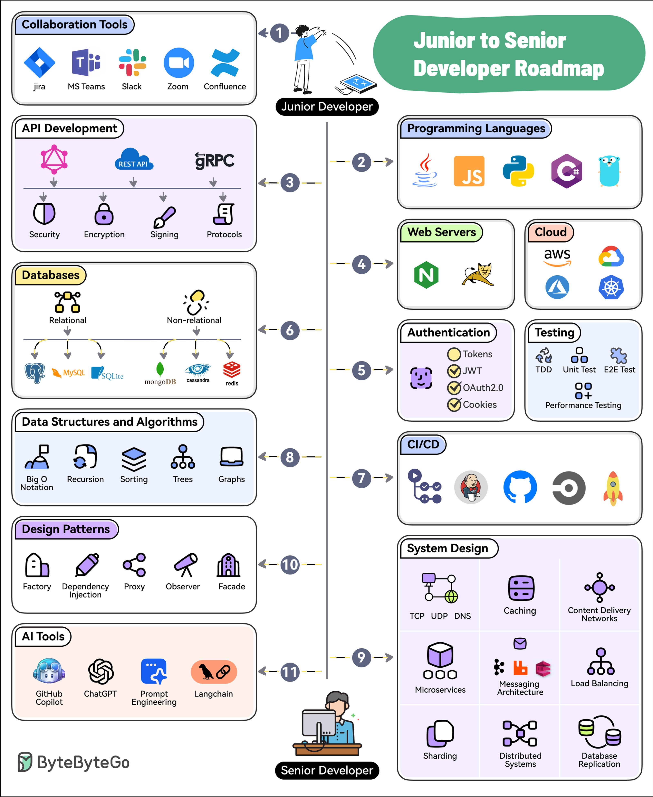

# developer_technical_growth_che

**Tweet URL:** [/sahnlam/status/1885197578389905733](/sahnlam/status/1885197578389905733)

**Tweet Text:** Developer Technical Growth Checklist

**Image 1 Description:** The infographic, titled "Junior to Senior Developer Roadmap," presents a comprehensive roadmap for junior developers seeking to advance their skills and become senior developers. The roadmap is divided into 11 sections, each representing a stage in the developer's journey.

*   **Collaboration Tools**
    *   Jira
    *   MS Teams
    *   Slack
    *   Zoom
    *   Confluence
*   **API Development**
    *   REST API
    *   gRPC
*   **Programming Languages**
    *   Java Script
    *   Python
    *   C#
*   **Web Servers**
    *   Nginx
    *   Apache
*   **Authentication**
    *   Tokens
    *   JWT
    *   OAuth2.0
*   **Testing**
    *   Unit Testing
    *   Integration Testing
    *   Performance Testing
*   **System Design**
    *   TCP
    *   UDP
    *   DNS
    *   Caching
*   **Content Delivery Networks (CDNs)**
    *   Cloudflare
    *   AWS CloudFront
*   **Load Balancing**
    *   HAProxy
    *   NGINX
*   **Database Replication**
    *   MySQL
    *   PostgreSQL
*   **Data Structures and Algorithms**
    *   Big O Notation
    *   Recursion
    *   Sorting
    *   Trees
    *   Graphs
*   **Design Patterns**
    *   Factory
    *   Dependency Injection
    *   Proxy
    *   Observer
    *   Facade
*   **Artificial Intelligence (AI) Tools**
    *   GitHub Copilot
    *   ChatGPT

The infographic provides a clear and concise roadmap for junior developers to follow, outlining the key areas of focus and skills required to progress from junior to senior developer. By following this roadmap, developers can gain the necessary knowledge and experience to become proficient in various programming languages, frameworks, and tools, ultimately leading to a successful career as a senior developer.

