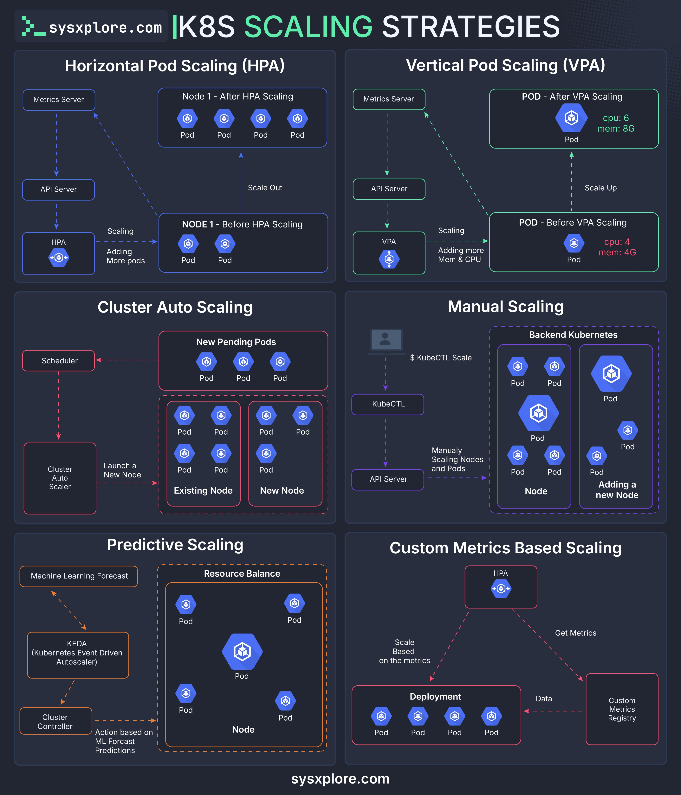

# kubernetes_scaling_strategies

**Tweet URL:** [/sysxplore/status/1885612358875197666](/sysxplore/status/1885612358875197666)

**Tweet Text:** Kubernetes Scaling Strategies

**Image 1 Description:** The infographic, titled "K8S Scaling Strategies," presents a comprehensive overview of various scaling strategies for Kubernetes (K8s) environments. The title is prominently displayed in white text at the top, with the website "sysxplore.com" written below it.

**Scaling Strategies:**

* **Horizontal Pod Scaling (HPA):**
	+ Node 1: After HPA Scaling
	+ NODE 1: Before HPA Scaling
* **Vertical Pod Scaling (VPA):**
	+ POD - After VPA Scaling
	+ POD - Before VPA Scaling
* **Cluster Auto Scaling:**
	+ New Pending Pods
* **Manual Scaling:**
	+ API Server
	+ KubeCTL Scale
* **Predictive Scaling:**
	+ Machine Learning Forecast
* **Custom Metrics-Based Scaling:**

The infographic provides a clear and concise visual representation of the different scaling strategies, making it easy to understand and compare their approaches. The use of simple graphics and diagrams helps to illustrate each strategy, allowing readers to quickly grasp the key concepts.

Overall, the infographic offers a valuable resource for anyone looking to learn about Kubernetes scaling strategies and how to effectively manage their K8s environments.

