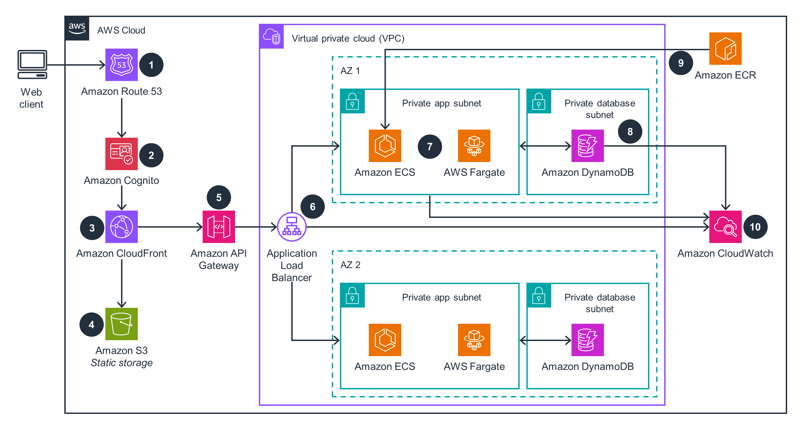

# learn_build_tier_containerized

**Tweet URL:** [/techyoutbe/status/1884553905226592463](/techyoutbe/status/1884553905226592463)

**Tweet Text:** Learn how to: Build 3-Tier Containerized and Scalable Web Application on AWS

> Step by Step (Helpful for beginner to Expert)
> Followed all 6 Well Architect Pillars

**Image 1 Description:** The image presents a comprehensive overview of an AWS architecture, showcasing various components and their interconnections. The diagram is divided into several sections, each representing a different aspect of the infrastructure.

**AWS Components:**

*   **EC2 Instance:** Represented by a blue rectangle with a white icon, this component is labeled as "Amazon ECS" (Elastic Container Service).
*   **RDS Database:** Illustrated by a red rectangle with a white icon, this section is denoted as "Amazon RDS" (Relational Database Service).
*   **S3 Bucket:** Depicted by a green rectangle with a white icon, this component is labeled as "Amazon S3" (Simple Storage Service).

**Network Connections:**

*   **VPC:** The Virtual Private Cloud (VPC) is represented by a purple line connecting the EC2 instance and RDS database.
*   **Subnet:** A subnet is depicted as a blue rectangle with a white icon, connected to the VPC via a green line.
*   **Security Group:** Illustrated by a red rectangle with a white icon, this component is connected to the subnet via a purple line.

**Services and Tools:**

*   **ECS Cluster:** Represented by a yellow rectangle with a white icon, this section is labeled as "Amazon ECS Cluster".
*   **CloudWatch Metrics:** Depicted by a gray rectangle with a white icon, this component is connected to the ECS cluster via a blue line.
*   **Route 53:** Illustrated by a purple rectangle with a white icon, this service is connected to the VPC via a green line.

**Other Components:**

*   **IAM Role:** Represented by a pink rectangle with a white icon, this component is labeled as "Amazon IAM Role".
*   **CloudFront Distribution:** Depicted by a blue rectangle with a white icon, this section is connected to the S3 bucket via a purple line.
*   **Route 53 Health Check:** Illustrated by a green rectangle with a white icon, this service is connected to the CloudFront distribution via a blue line.

In summary, the image provides a detailed illustration of an AWS architecture, highlighting various components and their interconnections. The diagram showcases the integration of EC2 instances, RDS databases, S3 buckets, VPCs, subnets, security groups, ECS clusters, CloudWatch metrics, Route 53, IAM roles, and CloudFront distributions.

