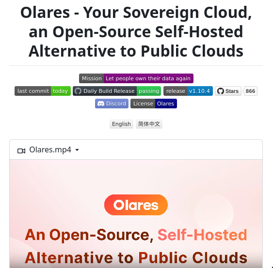

# olares_open_source_self

**Tweet URL:** [/tom_doerr/status/1866924973610180845](/tom_doerr/status/1866924973610180845)

**Tweet Text:** Olares is an open-source, self-hosted cloud alternative to public clouds like AWS,  allowing users to manage their data, applications, and computing resources locally

**Image 1 Description:** The image depicts a screenshot of an online repository page for Olares, a self-hosted alternative to public clouds.

*   **Header**
    *   The title "Olares - Your Sovereign Cloud, an Open-Source Self-Hosted Alternative to Public Clouds" is prominently displayed in black text.
    *   Below the title, there are various colored links with white text that read: Mission, Let people own their data again, last commit today, Daily Build Release passing, release v1.10.4, Stars 866, Discord, License, and Olares.
*   **Main Content**
    *   A screenshot of a video player is visible in the center of the page, featuring an orange button labeled "Olares" with white text.
    *   Below the video player, there is a pink rectangle containing the words "An Open-Source, Self-Hosted Alternative to Public Clouds" in red and black text.
*   **Footer**
    *   The background of the page is white.

In summary, the image showcases the Olares repository page on an online platform, highlighting its mission, features, and benefits as a self-hosted alternative to public clouds.

