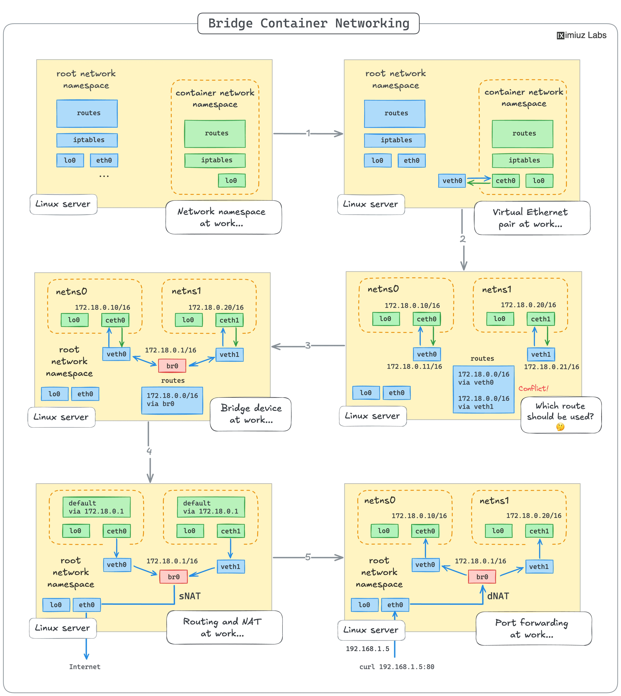

# main_container_networking_conc

**Tweet URL:** [/iximiuz/status/1887896876709556688](/iximiuz/status/1887896876709556688)

**Tweet Text:** Main Container Networking Concepts on a Single Diagram 

- Network namespace
- Virtual Ethernet device
- Linux bridge device
- Routing and NAT
- Port publishing

Check out the next tweet for a hands-on learning path 

**Image 1 Description:** The image presents a comprehensive overview of Bridge Container Networking, showcasing various configurations and connections between containers within a network. The diagram illustrates the relationships between different components, including containers, networks, and bridges.

**Key Components:**

* **Containers:** Represented by rectangles with rounded corners, each container has its own IP address and is connected to the network through an interface.
* **Networks:** Depicted as rectangular boxes with a dashed border, networks provide connectivity between containers and are identified by their subnet mask or CIDR notation.
* **Bridges:** Illustrated as trapezoidal shapes, bridges connect multiple networks and allow traffic to flow between them. They also enable the creation of virtual networks within a physical network.

**Network Configurations:**

* **Simple Network:** A basic configuration featuring one container connected directly to a network.
* **Bridge-based Network:** Containers are connected to separate networks, which are then bridged together using a bridge device.
* **Multiple Bridges:** Multiple bridges are used to connect multiple containers across different networks.

**Connections and Traffic Flow:**

* **Direct Connections:** Containers can be connected directly to each other without the need for a bridge.
* **Bridged Connections:** Containers are connected through a bridge, allowing traffic to flow between them.
* **Traffic Flow:** Arrows indicate the direction of traffic flow between containers and networks.

**Legend and Labels:**

* **Container IDs:** Unique identifiers assigned to each container.
* **Network Names:** Descriptive labels for each network.
* **Bridge Names:** Identifiers for each bridge device.
* **Interface Names:** Labels for each interface connecting a container to the network.

In summary, the image provides a detailed visual representation of Bridge Container Networking, highlighting various configurations and connections between containers within a network. The diagram effectively illustrates how containers can be connected to networks using bridges, enabling traffic flow between them.

