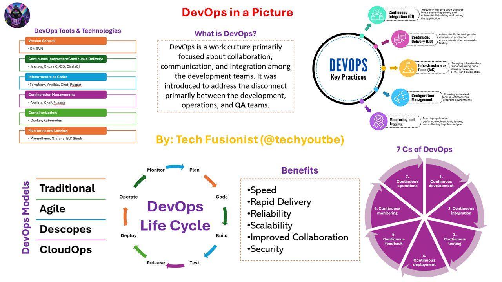

# devops_simplified_tweet_text

**Tweet URL:** [/techyoutbe/status/1868258946919592207](/techyoutbe/status/1868258946919592207)

**Tweet Text:** DevOps (Simplified)

**Image 1 Description:** The image presents an infographic about DevOps, a software development methodology that combines development (Dev) and operations (Ops) into a single workflow. The infographic is divided into several sections, each highlighting different aspects of DevOps.

* **What is DevOps?**
	+ Definition: A work culture primarily focused on collaboration, communication, and integration among development teams.
	+ Benefits:
		- Speed
		- Rapid delivery
		- Reliability
		- Scalability
		- Improved collaboration
		- Enhanced security
* **Key Practices of DevOps**
	+ Continuous Integration (CI)
	+ Continuous Delivery (CD)
	+ Infrastructure as Code (IaC)
	+ Configuration Management
	+ Monitoring and Logging
	+ Testing and Quality Assurance
	+ Release Management
	+ Deployment Automation
* **DevOps Life Cycle**
	+ Plan
	+ Code
	+ Build
	+ Test
	+ Deploy
	+ Monitor
	+ Operate
	+ Release
	+ Repeat
* **Benefits of DevOps**
	+ Speed
	+ Rapid delivery
	+ Reliability
	+ Scalability
	+ Improved collaboration
	+ Enhanced security
* **DevOps Tools and Technologies**
	+ Git
	+ SVN
	+ Jenkins
	+ Docker
	+ Kubernetes
	+ Prometheus
	+ Grafana
	+ ELK Stack

In summary, the infographic provides an overview of DevOps, its key practices, benefits, life cycle, and tools and technologies. It highlights the importance of collaboration, communication, and integration in achieving faster time-to-market, improved quality, and enhanced security.

