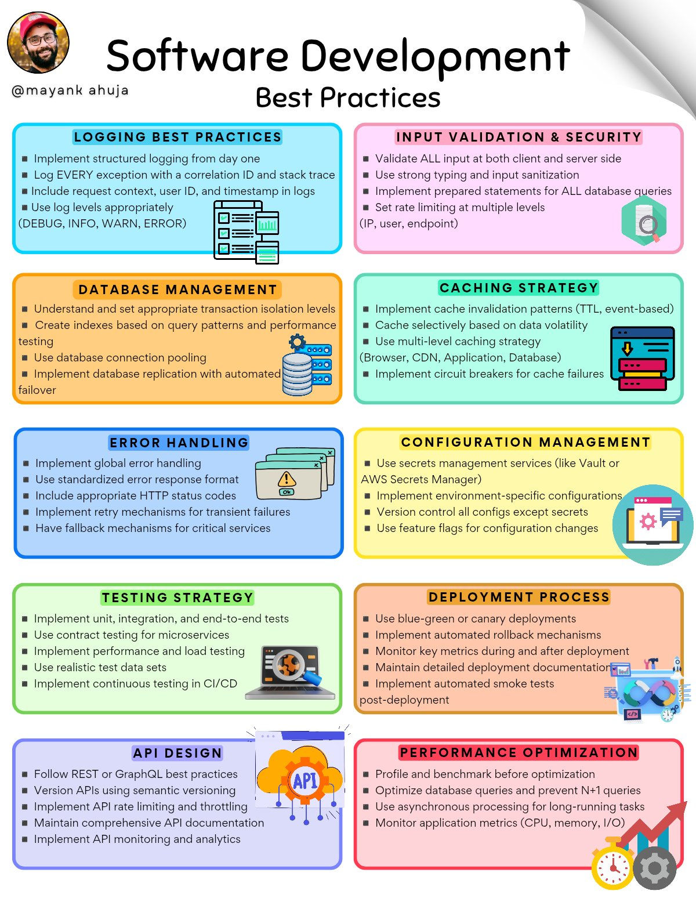

# software_development_best_practices

**Tweet URL:** [/techNmak/status/1888130153122758709](/techNmak/status/1888130153122758709)

**Tweet Text:** 10 Software Development Best Practices I Learned the Hard Way . 

[ If you like my efforts, please repost & follow 
@techNmak
 ]

Remember,

 Complex code = Complex bugs 

 Maintainable > Clever

**Image 1 Description:** The infographic, titled "Software Development Best Practices," presents a comprehensive guide to software development best practices in 10 distinct sections. Each section is represented by a different color and features a unique icon, accompanied by a list of bullet points that outline key considerations for effective software development.

* **Logging Best Practices**
	+ Implement structured logging from day one
	+ Log every exception with a correlation ID and stack trace
	+ Include request context, user ID, and timestamp in logs
	+ Use log levels appropriately (DEBUG, INFO, WARN, ERROR)
* **Input Validation and Security**
	+ Validate ALL input at both client and server sides
	+ Use strong typing and input sanitization
	+ Implement prepared statements for ALL database queries
	+ Set rate limiting at multiple levels (IP, user, endpoint)
* **Database Management**
	+ Understand and set appropriate transaction isolation levels
	+ Create indexes based on query patterns and performance testing
	+ Use database connection pooling
	+ Implement database replication with automated failover
* **Error Handling**
	+ Implement global error handling
	+ Use standardized error response formats
	+ Include appropriate HTTP status codes
	+ Implement retry mechanisms for transient failures
	+ Have fallback mechanisms for critical services
* **Configuration Management**
	+ Use secrets management services like Vault or AWS Secrets Manager
	+ Implement environment-specific configurations
	+ Control all config except secrets
	+ Use feature flags for configuration changes
* **Testing Strategy**
	+ Implement unit, integration, and end-to-end tests
	+ Use contract testing for microservices
	+ Perform performance and load testing
	+ Use realistic test data sets
	+ Continuously integrate and deploy applications
* **Deployment Process**
	+ Use blue-green or canary deployments
	+ Implement automated rollback mechanisms
	+ Monitor key metrics during and after deployment
	+ Maintain detailed deployment documentation
	+ Implement automated smoke tests post-deployment
* **API Design**
	+ Follow REST or GraphQL best practices
	+ Version APIs using semantic versioning
	+ Implement API rate limiting and throttling
	+ Maintain comprehensive API documentation
	+ Implement API monitoring and analytics
* **Performance Optimization**
	+ Profile and benchmark before optimization
	+ Optimize database queries and prevent N+1 queries
	+ Use asynchronous processing for long-running tasks
	+ Monitor application metrics (CPU, memory, I/O)

This infographic provides a comprehensive guide to software development best practices, covering various aspects of the development process. By following these guidelines, developers can ensure that their applications are robust, secure, and performant.

