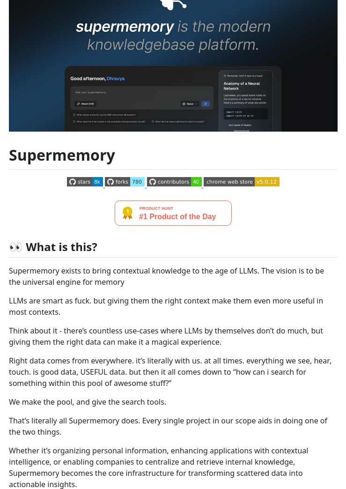

# powered_bookmark_knowledge_manager

**Tweet URL:** [/tom_doerr/status/1884514150606315598](/tom_doerr/status/1884514150606315598)

**Tweet Text:** AI-powered bookmark and knowledge manager

**Image 1 Description:** The image presents Supermemory, a modern knowledge base platform that enables users to access and utilize various types of data. The platform's interface is designed to be user-friendly and intuitive, with clear headings and concise descriptions.

* **Supermemory Logo**
	+ Located at the top-left corner of the page
	+ Features a stylized letter "S" made up of small circles
* **Platform Description**
	+ Headline: "supermemory is the modern knowledgebase platform."
	+ Subheading: "Access and utilize various types of data with ease."
* **Features Section**
	+ Headline: "What makes Supermemory special?"
	+ Bullet points:
		- Access to a vast library of information
		- Ability to create custom knowledge bases
		- Integration with popular tools and services
* **Call-to-Action Button**
	+ Located at the bottom-right corner of the page
	+ Text: "Get Started"
	+ Icon: A small arrow pointing downwards
* **Background Image**
	+ Depicts a futuristic cityscape with towering skyscrapers and flying cars
	+ Suggests a cutting-edge and innovative approach to knowledge management

Overall, the image effectively communicates the key features and benefits of Supermemory, while also conveying a sense of innovation and forward-thinking. The use of a clear and concise design makes it easy for users to quickly understand what Supermemory has to offer.

