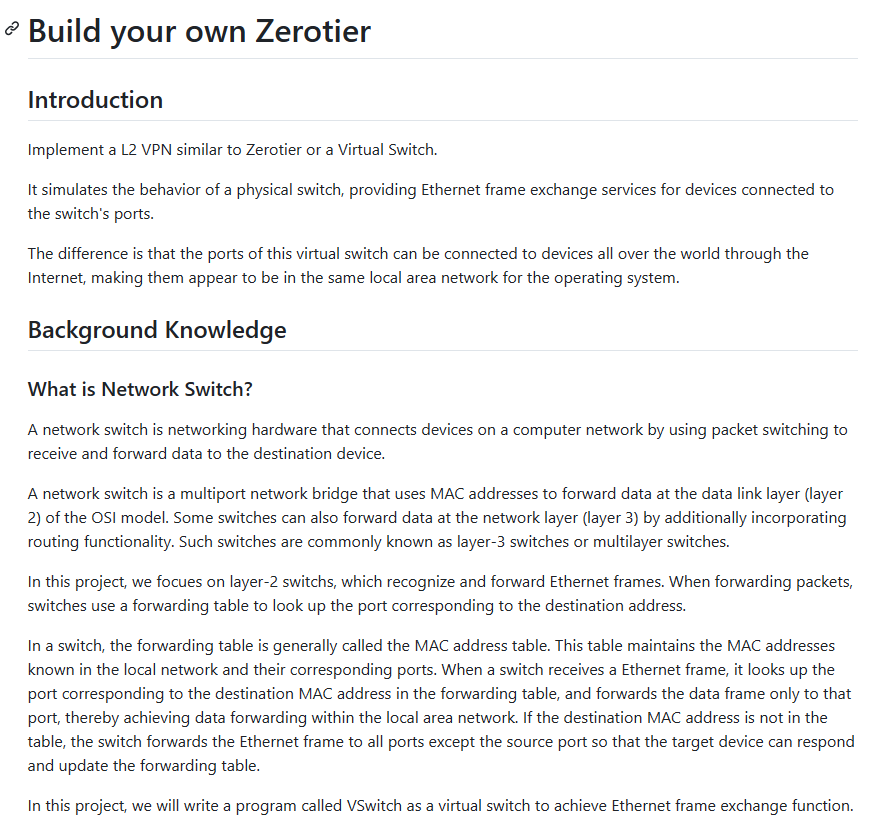

# build_your_layer_virtual

**Tweet URL:** [/Abhishekcur/status/1870838148789633295](/Abhishekcur/status/1870838148789633295)

**Tweet Text:** Build your own layer-2 virtual switch
-under 300 lines of code
-in C and some Python
-it's a great resource
-just have some knowledge of computer networks before this

**Image 1 Description:** The image presents a screenshot of an online tutorial or guide focused on building one's own Zerotier, with the title "Build your own Zerotier" prominently displayed at the top.

**Main Points:**

* **Introduction**
	+ The introduction section provides a brief overview of the topic and its significance.
	+ It highlights the importance of understanding network protocols and devices for effective communication over the internet.
* **Background Knowledge**
	+ This section delves into the background knowledge required to comprehend the tutorial.
	+ It covers topics such as network protocols, devices, and their functions in facilitating online interactions.
* **What is Network Switch?**
	+ The next section explains what a network switch is and its role in connecting devices within a local area network (LAN).
	+ It describes how switches operate and their significance in ensuring efficient data transmission between devices.

**Summary:**

In summary, the image provides a comprehensive guide to building one's own Zerotier, covering essential background knowledge and concepts related to network protocols and devices. The tutorial aims to equip readers with the necessary skills to create a secure and reliable online connection using Zerotier technology.

