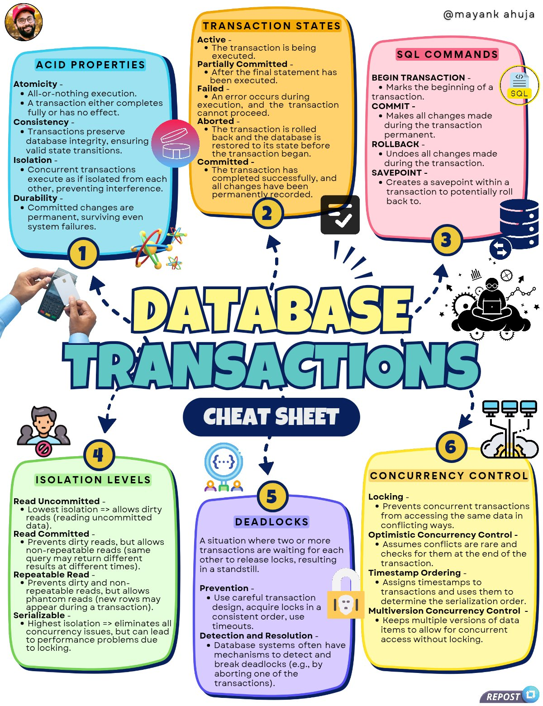

# cheat_sheet_database_transactions

**Tweet URL:** [/techNmak/status/1885699330553643249](/techNmak/status/1885699330553643249)

**Tweet Text:** My cheat sheet on - Database Transactions.

Show some love and support to my work.

**Image 1 Description:** The infographic, titled "Database Transactions Cheat Sheet," presents a comprehensive overview of database transactions in a visually engaging format. The title is prominently displayed at the center of the image.

**Key Features:**

* **Colorful Background:** A white background provides a clean canvas for the colorful graphics and text.
* **Central Title:** The title "Database Transactions Cheat Sheet" is written in large, bold letters with a dark blue outline, drawing attention to its importance.
* **Six Sections:** The infographic is divided into six sections, each representing a distinct aspect of database transactions:
	+ Acid Properties
	+ Transaction States
	+ SQL Commands
	+ Isolation Levels
	+ Deadlocks
	+ Concurrency Control

**Section Breakdown:**

Each section is represented by a unique color and features a relevant graphic or icon. The sections are:

* **Acid Properties:** A blue rectangle with a white lock icon, highlighting the importance of atomicity.
* **Transaction States:** An orange rectangle with a clock icon, illustrating the various states of a transaction.
* **SQL Commands:** A pink rectangle with a database icon, showcasing common SQL commands used in transactions.
* **Isolation Levels:** A green rectangle with a person icon, explaining different isolation levels and their implications.
* **Deadlocks:** A purple rectangle with a warning icon, discussing the causes and prevention of deadlocks.
* **Concurrency Control:** A yellow rectangle with a lock icon, highlighting the importance of concurrency control in ensuring data consistency.

**Additional Elements:**

The infographic includes several additional elements to enhance its visual appeal and provide supplementary information:

* **Arrows:** Arrows connect each section, creating a sense of flow and continuity throughout the infographic.
* **Numbers:** Each section is labeled with a number (1-6), making it easy to navigate and reference specific sections.
* **Icons:** Relevant icons are used throughout the infographic to add visual interest and illustrate key concepts.

**Conclusion:**

The "Database Transactions Cheat Sheet" infographic provides a comprehensive and engaging overview of database transactions. Its colorful design, clear headings, and concise explanations make it an excellent resource for anyone looking to understand this complex topic.

