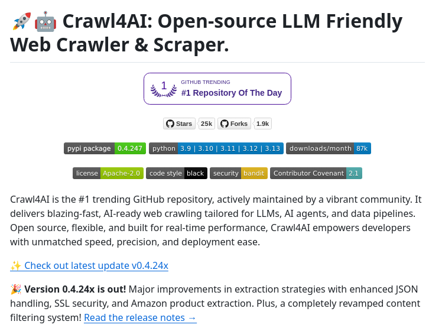

# crawler_scraper_data_tweet

**Tweet URL:** [/tom_doerr/status/1880504404555514011](/tom_doerr/status/1880504404555514011)

**Tweet Text:** Web crawler and scraper for AI data

**Image 1 Description:** The image displays a screenshot of the GitHub page for Crawl4AI, an open-source web crawler.

* **Title**
	+ The title is "Craw4AI: Open-source LLM Friendly Web Crawler & Scraper."
* **Logo**
	+ A red and gray robot icon with a blue speech bubble
* **Header Section**
	+ The header section includes a link to the project's GitHub page, as well as links to other related projects.
* **Main Content**
	+ The main content is divided into several sections:
		- **Description**: A brief summary of what Craw4AI is and how it works.
		- **Features**: A list of key features that make Craw4AI unique, including its ability to crawl large amounts of data quickly and efficiently.
		- **Use Cases**: Examples of how Craw4AI can be used in real-world scenarios, such as web scraping and data collection.
* **Footer Section**
	+ The footer section includes links to the project's documentation, issue tracker, and community forums.

Overall, the image provides a clear overview of what Craw4AI is and its capabilities, making it easy for users to understand how to use the tool.

