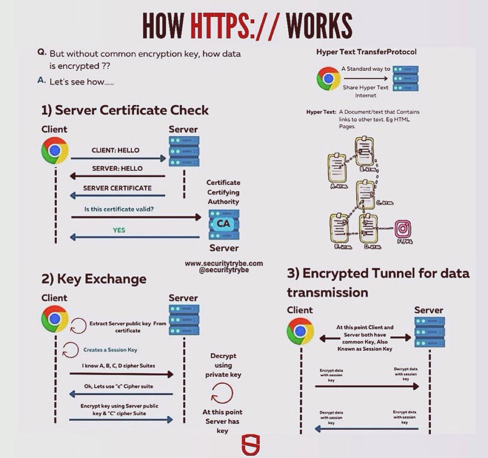

# https_works_tweet_text

**Tweet URL:** [/SecurityTrybe/status/1870833585361666405](/SecurityTrybe/status/1870833585361666405)

**Tweet Text:** HOW HTTPS:// WORKS

**Image 1 Description:** The image presents a comprehensive overview of how HTTPS (Hypertext Transfer Protocol Secure) works, providing a detailed explanation of its key components and processes.

*   **1) Server Certificate Check**
    *   This section illustrates the process of server certificate verification in HTTPS.
        *   The client initiates a connection with the server.
        *   The server responds with its public key and digital certificate.
        *   The client verifies the authenticity of the certificate by checking its validity, issuer, and other attributes.
        *   If the certificate is valid, the client proceeds to establish an encrypted connection.
*   **2) Key Exchange**
    *   This section explains the process of exchanging cryptographic keys between the client and server.
        *   The client generates a random session key and encrypts it with the server's public key.
        *   The client sends the encrypted session key to the server.
        *   The server decrypts the session key using its private key and shares it with the client.
        *   Both parties now possess the same session key, which is used for encryption and decryption of data exchanged during the session.
*   **3) Encrypted Tunnel for Data Transmission**
    *   This section describes how data is transmitted securely over an encrypted tunnel.
        *   All data exchanged between the client and server is encrypted using the shared session key.
        *   The encrypted data is sent through a secure channel, ensuring confidentiality and integrity of the data in transit.

In summary, the image provides a clear and concise explanation of the HTTPS protocol's key components and processes, including server certificate verification, key exchange, and encrypted data transmission. By understanding these concepts, users can better appreciate the security measures implemented by HTTPS to protect online communications.

