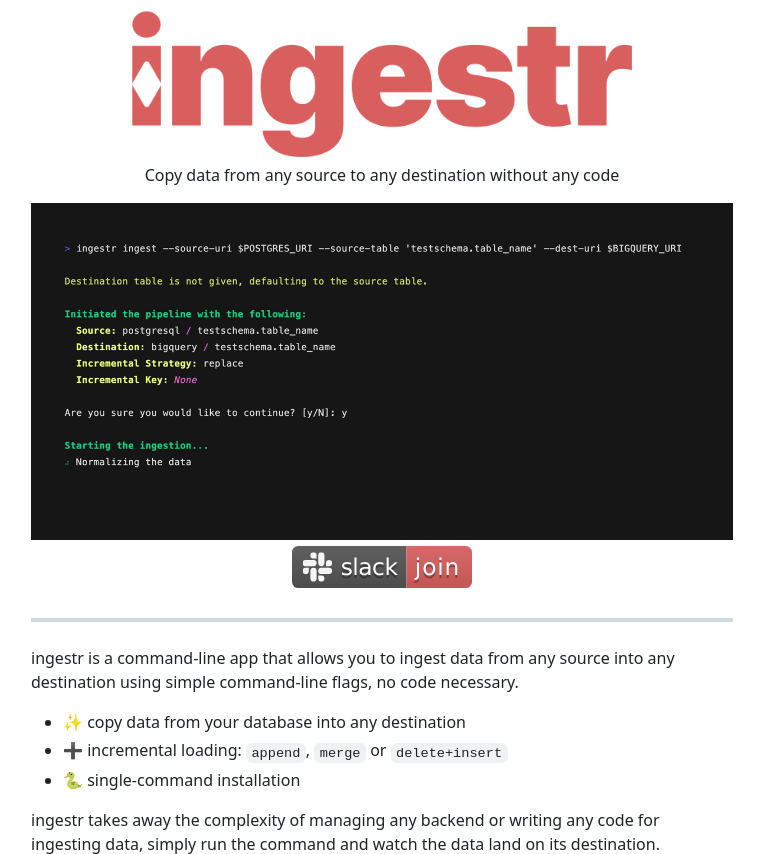

# ingestr_tool_copy_data

**Tweet URL:** [/tom_doerr/status/1875687158742237611](/tom_doerr/status/1875687158742237611)

**Tweet Text:** ingestr: A CLI tool to copy data from any source to any destination using simple command-line flags

**Image 1 Description:** The image presents a screenshot of the Ingestr command-line interface, featuring a prominent title at the top that reads "ingestr" in large red text. Below this, a smaller subtitle states, "Copy data from any source to any destination without code."

**Key Features:**

* **Code Window:** A black window displays a block of code with various colors, including green, yellow, and white.
* **Buttons:** Two buttons are situated below the code window:
	+ "slack" (in white) on a dark gray background
	+ "join" (in white) on a red background
* **Description Text:** A section of text at the bottom describes the purpose and functionality of Ingestr, including its ability to copy data from any source to any destination without code.

**Overall Impression:**

The image effectively showcases the user-friendly interface and capabilities of Ingestr, making it an attractive option for those seeking a convenient way to manage their data.

