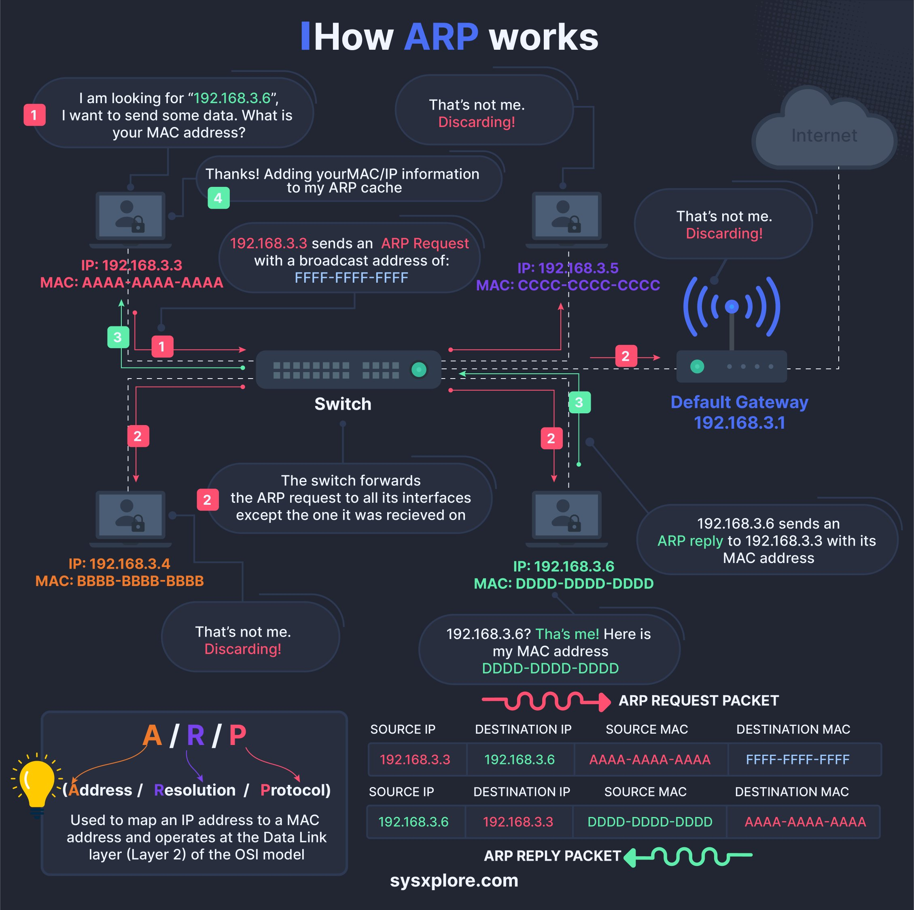

# networking_crash_course_how

**Tweet URL:** [/sysxplore/status/1869814952472748150](/sysxplore/status/1869814952472748150)

**Tweet Text:** Networking crash course - How ARP works.

**Image 1 Description:** The infographic, titled "How ARP Works," provides a comprehensive overview of the Address Resolution Protocol (ARP) process. The diagram illustrates the step-by-step interaction between devices on a network, using a combination of text bubbles and icons to convey the information.

**Key Components:**

* **Network Devices:** Represented by small rectangles with icons, these devices interact with each other through ARP requests and responses.
* **Text Bubbles:** Containing explanations and labels, these bubbles provide context for the ARP process.
* **Arrows:** Indicate the direction of data flow between devices.
* **Icons:** Used to represent network devices and illustrate the interactions between them.

**ARP Process:**

1. **Device 1 Requests IP Address:** A device sends an ARP request to its default gateway, seeking the MAC address associated with a specific IP address.
2. **Default Gateway Responds:** The default gateway responds with its own MAC address, which is then used by Device 1 to send data packets to the intended recipient.
3. **Data Packet Sent:** Device 1 sends a data packet to the recipient's MAC address, which has been resolved through ARP.
4. **Recipient Responds:** The recipient device responds to the ARP request, providing its own MAC address.
5. **ARP Cache Updated:** Both devices update their ARP caches with the new information.

**Conclusion:**

The infographic effectively illustrates how ARP works, using a clear and concise format to explain the process. By following the diagram, readers can understand how devices on a network interact with each other through ARP requests and responses.

