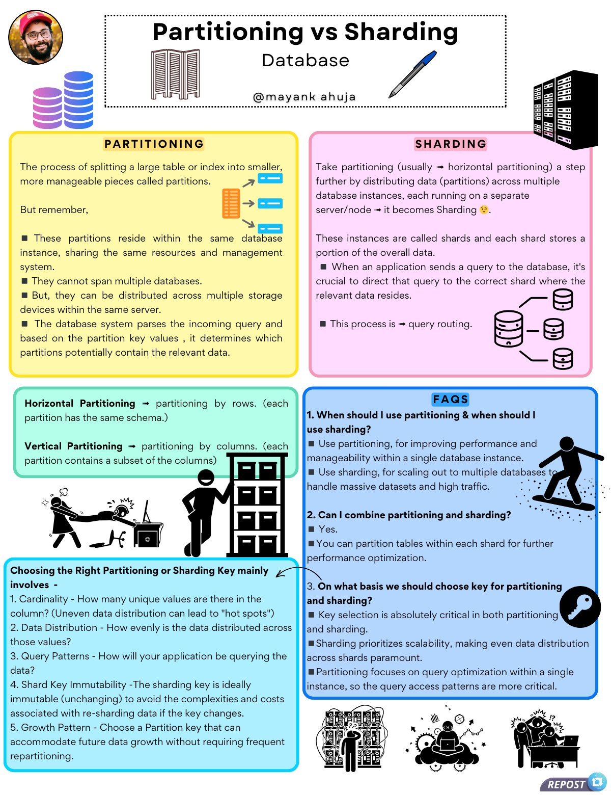

# notes_partitioning_sharding_enjoy

**Tweet URL:** [/techNmak/status/1886292559145918555](/techNmak/status/1886292559145918555)

**Tweet Text:** My Notes on 'Partitioning vs Sharding'. Enjoy and show some support.

**Image 1 Description:** The infographic, titled "Partitioning vs Sharding: Database," presents a comprehensive comparison between these two database management techniques. The image is divided into six sections, each with a distinct color scheme and graphics.

**Partitioning**

*   Definition: A process where data is split across multiple servers to improve performance.
*   Benefits:
    *   Improved query performance
    *   Simplified maintenance
*   Limitations:
    *   Inefficient for large datasets

**Sharding**

*   Definition: Similar to partitioning, but each shard can be stored on a separate server or node.
*   Benefits:
    *   Increased scalability
    *   Better fault tolerance
*   Limitations:
    *   Complex to manage

**Horizontal Partitioning (Partition by Rows)**

*   Definition: A type of partitioning where data is split horizontally, meaning each row goes to a different server or node.
*   Benefits:
    *   Easy to implement
    *   Good for real-time analytics

**Vertical Partitioning (Partition by Columns)**

*   Definition: A type of partitioning where data is split vertically, meaning each column goes to a different server or node.
*   Benefits:
    *   Reduced storage requirements
    *   Better performance for specific queries

**Choosing the Right Technique**

*   Considerations:
    *   Data size and complexity
    *   Query patterns
    *   Scalability needs

In summary, the infographic provides a detailed comparison of partitioning and sharding techniques, highlighting their benefits and limitations. It also explains horizontal and vertical partitioning methods and offers guidance on choosing the right technique for specific use cases.

