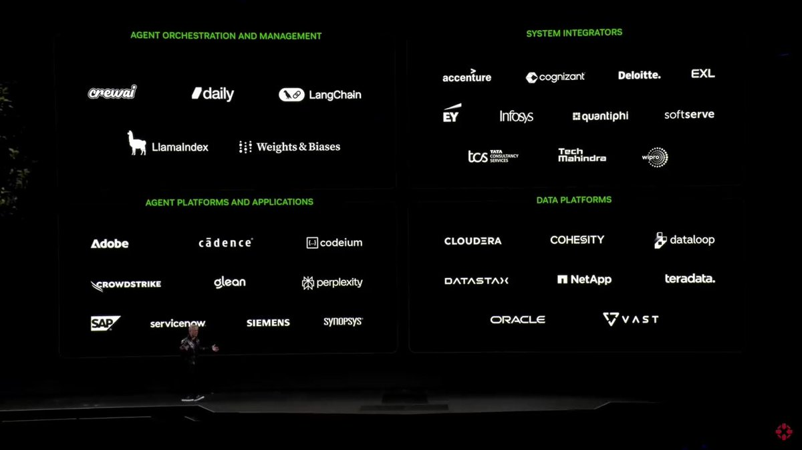

# this_literally_telling_make

**Tweet URL:** [/DekmarTrades/status/1876472202058445225](/DekmarTrades/status/1876472202058445225)

**Tweet Text:** This man is literally telling us how to MAKE MILLIONS OF DOLLARS and everyone is half asleep in that crowd.

I am about to have the BIGGEST YEAR OF MY LIFE! $NVDA

**Image 1 Description:** The image presents a comprehensive overview of various companies and their roles within the field of data integration, featuring a black background with white text.

**Overview:**
The image appears to be an infographic or slide from a presentation about data integration, showcasing a diverse range of companies involved in this process.

**List of Companies and Their Roles:**

* **Agent Orchestration and Management:** 
  * OneWai
  * Daily
  * LangChain

* **System Integrators:**
  * Accenture
  * Cognizant
  * Deloitte
  * EXL
  * EY
  * Infosys
  * Quantiphi
  * Softserve
  * Tech Mahindra
  * Wipro

* **Data Platforms:**
  * Cloudera
  * Cohesity
  * Datallioop
  * NetApp
  * Teradata

* **Agent Platforms and Applications:**
  * Adobe
  * Cadence
  * Glean
  * Perplexity
  * Siemens
  * Synopsys

**Summary:**
The image provides a detailed list of companies involved in data integration, categorized by their specific roles. This infographic likely serves as a reference or educational tool for those interested in learning more about the various players in this field.

