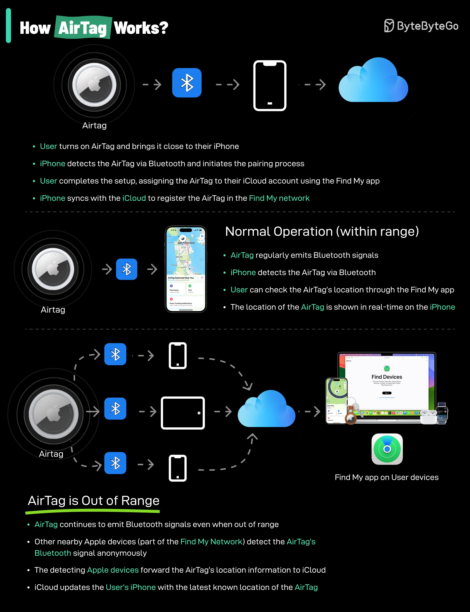

# airtag_works_tweet_text

**Tweet URL:** [/sahnlam/status/1879396854208847926](/sahnlam/status/1879396854208847926)

**Tweet Text:** How AirTag works?

**Image 1 Description:** The image is an infographic titled "How AirTag Works?" and provides a detailed explanation of how Apple's AirTag device functions.

**Title Section**

* The title, "How AirTag Works?", is prominently displayed in white text within a green rectangle at the top left corner.
* In the top right corner, the ByteByteGo logo is visible.

**Main Content**

The infographic is divided into three sections:

1. **AirTag Functionality**
	+ This section explains how an AirTag works when paired with an iPhone or iPad.
	+ It highlights that the user turns on the AirTag and brings it close to their device, which detects the AirTag via Bluetooth.
	+ The iPhone initiates the pairing process, and the user completes the setup by assigning the AirTag to their iCloud account using the Find My app.
	+ Once paired, the AirTag syncs with the iCloud to register itself in the Find My network.

2. **Normal Operation**
	* This section describes the normal operation of an AirTag when it is not being actively used or searched for.
	* It states that the AirTag regularly emits Bluetooth signals, which are detected by nearby Apple devices (part of the Find My Network).
	* These devices forward the location information to iCloud, where it is updated in real-time on the user's iPhone.

3. **AirTag Out of Range**
	* This section explains what happens when an AirTag is out of range or not being actively used.
	* It notes that the AirTag continues to emit Bluetooth signals even when out of range.
	* Other nearby Apple devices detect these signals and forward them to iCloud, where they are stored anonymously.

**Additional Information**

At the bottom right corner, a list of sources is provided:

* Find My app on User devices
* Find My app on Devices

Overall, the infographic effectively illustrates how AirTag works and provides a clear understanding of its functionality.

