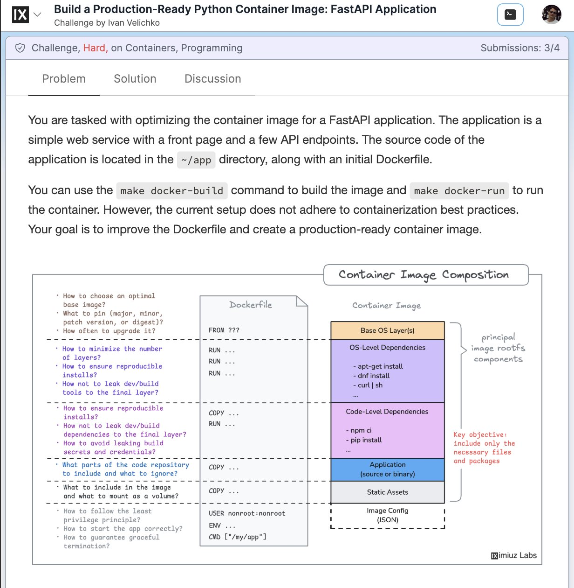

# containerize_python_right_building

**Tweet URL:** [/iximiuz/status/1885755816365400433](/iximiuz/status/1885755816365400433)

**Tweet Text:** How do you containerize a Python app the right way? 

Building small and secure images for Python projects is surprisingly hard:

- Which base image to choose?
- How to manage dependencies?
- How to structure the Dockerfile?

Learn more (with solutions): [https://labs.iximiuz.com/challenges/dockerize-python-application…](https://labs.iximiuz.com/challenges/dockerize-python-application…)

**Image 1 Description:** The image presents a screenshot of an online coding challenge, specifically designed for Python developers. The title at the top reads "Build a Production-Ready Python Container Image: FastAPI Application" in black text.

*   **Header**
    *   The header features a light blue background with white text.
    *   It includes the following elements:
        *   A black box with the letter "IX" in white, accompanied by a small downward arrow pointing to the left.
        *   The title of the challenge in black text: "Build a Production-Ready Python Container Image: FastAPI Application".
*   **Problem Statement**
    *   Below the header, there is a problem statement that outlines the task at hand:
        *   The user is tasked with optimizing the container image for a FastAPI application.
        *   The application is described as a simple web service with a front page and API endpoints.
        *   The source code of the application is located in the /app directory, along with an initial Dockerfile.
*   **Submission Form**
    *   At the bottom of the page, there is a submission form where users can upload their solutions.
    *   The form includes fields for:
        *   Uploading files (e.g., images, videos, documents)
        *   Entering descriptive text about the solution
*   **Additional Information**
    *   In the top-right corner, there are buttons to navigate through different sections of the challenge:
        *   A "Problem" button that takes users back to the problem statement
        *   A "Solution" button that allows them to view their submitted solutions
        *   A "Discussion" button that enables communication with other participants and moderators

In summary, this image displays a coding challenge platform where developers can participate in building a production-ready Python container image for a FastAPI application. The platform provides a clear problem statement, submission form, and additional navigation buttons to facilitate the development process.

