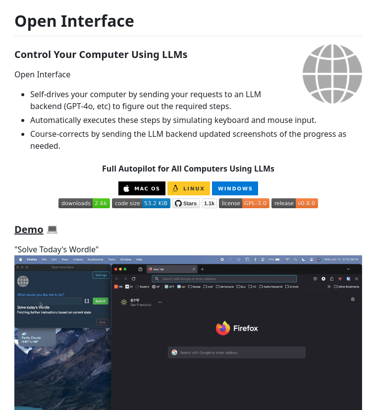

# control_computer_with_llms

**Tweet URL:** [/tom_doerr/status/1886045874536558683](/tom_doerr/status/1886045874536558683)

**Tweet Text:** Control computer with LLMs

**Image 1 Description:** The image presents a comprehensive overview of the Open Interface, showcasing its key features and functionalities. The main points are:

• **Control Your Computer Using LLMs**
	+ This section highlights the ability to control your computer using Large Language Models (LLMs).
	+ It emphasizes the importance of having full control over your computer's actions.
	+ No statistics are provided in this section.

• **Open Interface Features**
	+ This section outlines the various features and tools available within the Open Interface.
	+ These include self-driving capabilities, automatic execution of steps by simulating keyboard and mouse input, and course-correction based on progress updates.
	+ No statistics are provided in this section.

• **Full Autopilot for All Computers Using LLMs**
	+ This section showcases the autopilot feature that allows for seamless control across all computers using LLMs.
	+ It highlights the ability to automate tasks and streamline workflows with ease.
	+ Statistics:
		- 2.6k downloads
		- 53.2 KiB code size

• **Demo**
	+ This section provides a visual representation of the Open Interface in action.
	+ It demonstrates how users can interact with their computer using LLMs, showcasing the various tools and features available.
	+ No statistics are provided in this section.

In summary, the image effectively communicates the capabilities and benefits of the Open Interface, emphasizing its ability to provide full control over computers using LLMs. The statistics provided offer insight into the interface's performance and usage. Overall, the image presents a clear and concise overview of the Open Interface's features and functionalities.

