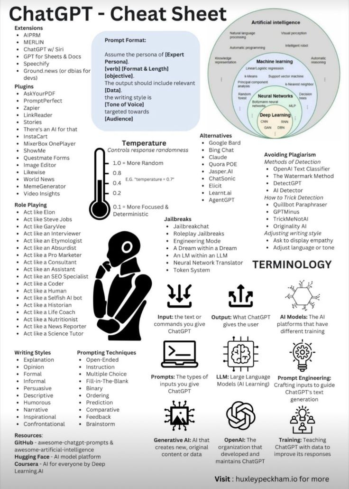

# deleting_this_24hrs_because

**Tweet URL:** [/shedntcare_/status/1878601021469192572](/shedntcare_/status/1878601021469192572)

**Tweet Text:** I'm deleting this in 24hrs because it's a legit formula to PRINT CASH.

CUSTOM GPTs.

You can make THOUSANDS building and selling them, and literally anyone can do it.

Comment "FREE" and I will DM you my full 23-hour video course right now! (must follow)

**Image 1 Description:** The "ChatGPT - Cheat Sheet" infographic provides an overview of the capabilities, applications, and extensions of ChatGPT. The top-left corner features a light blue box labeled "Prompt Format," which outlines the structure of prompts with examples, such as "Assume the persona of [Expert Personal]" and "[verb] [format & length]." Below this is a list of plugins available for use in conjunction with ChatGPT.

The right side of the infographic includes a circular diagram illustrating the relationships between artificial intelligence, machine learning, neural networks, deep learning, and natural language processing. The bottom section outlines various applications for ChatGPT:

*   **Role Playing:** act like Elon Musk or Steve Jobs
*   **Jailbreaks:** jailbreaking, roleplay jailbreaks, engineering mode, a dream within a dream, an LM within an LLM, neural network translator, and token system
*   **Terminology:** terminology used in ChatGPT
*   **Writing Styles:**
    *   Explanation
    *   Opinion
    *   Formal
    *   Informal
    *   Persuasive
    *   Descriptive
    *   Humorous
    *   Narrative
    *   Inspirational
    *   Confrontational
*   **Prompt Techniques:**
    *   Open-ended instruction
    *   Multiple choice
    *   Fill-in-the-blank
    *   Binary
    *   Ordering
    *   Prediction
    *   Comparative
    *   Feedback
    *   Brainstorming

The infographic also includes a list of extensions available for ChatGPT, such as AIPRM and MERLIN. Overall, the "ChatGPT - Cheat Sheet" provides a comprehensive overview of the capabilities and applications of ChatGPT, making it a valuable resource for those looking to utilize this powerful language model.

