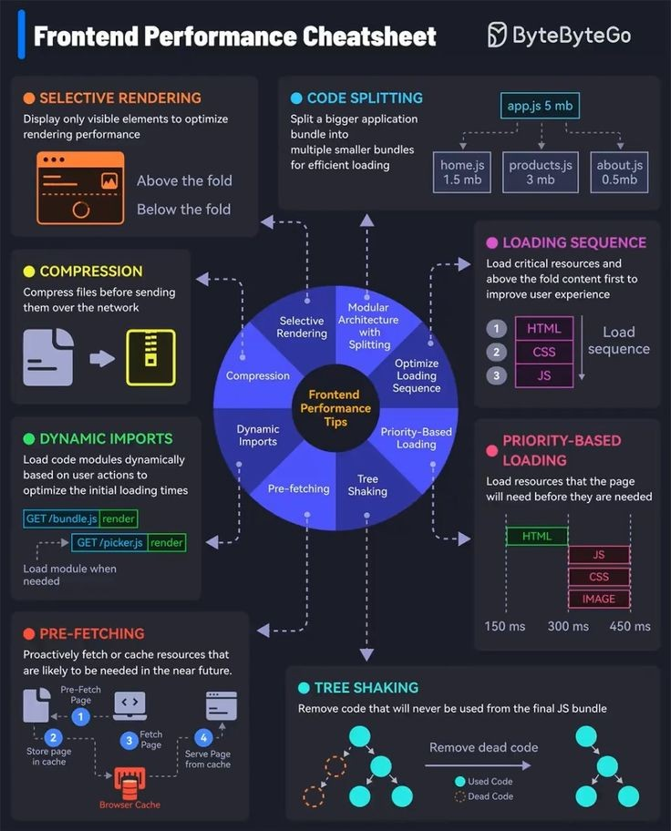

# frontend_development_performance_cheatsheet

**Tweet URL:** [/e_opore/status/1886734091829055994](/e_opore/status/1886734091829055994)

**Tweet Text:** Frontend development Performance Cheatsheet.

**Image 1 Description:** The infographic, titled "Frontend Performance Cheatsheet," presents a comprehensive guide to optimizing frontend performance. The title is displayed in white text at the top left corner of the image.

**Key Concepts:**

* **Selective Rendering:** Display only visible elements to optimize rendering performance.
* **Code Splitting:** Split larger applications into smaller, more manageable bundles for efficient loading.
* **Compression:** Compress files before sending them over the network to reduce payload size.
* **Dynamic Imports:** Load code modules dynamically based on user actions to optimize initial loading times.

**Performance Tips:**

* **Modular Architecture with Splitting:** Organize code into smaller, reusable modules to improve maintainability and performance.
* **Prioritize Loading Sequence:** Load critical resources first to ensure a smooth user experience.
* **Tree Shaking:** Remove unused code from the final bundle to reduce payload size.

**Performance Metrics:**

* **Loading Sequence:** Load critical resources before non-critical ones.
* **Priority-Based Loading:** Prioritize loading sequence based on user experience.
* **Tree Shaking:** Remove unused code from the final bundle.

**Conclusion:**

The infographic provides a concise and informative guide to optimizing frontend performance. By implementing these strategies, developers can improve their application's speed, scalability, and maintainability.

