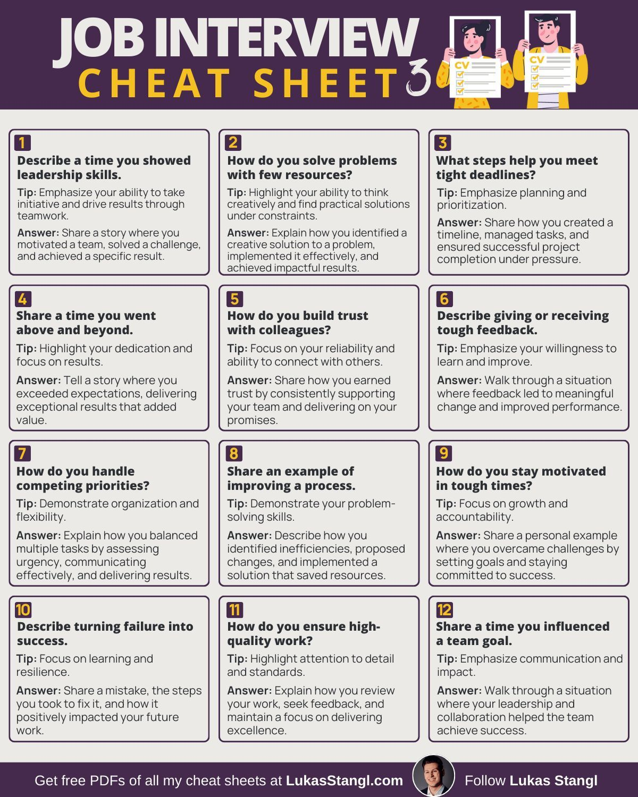

# interview_cheat_sheet_tweet

**Tweet URL:** [/AlwaysKeepL/status/1873152954003488820](/AlwaysKeepL/status/1873152954003488820)

**Tweet Text:** Job interview cheat sheet

**Image 1 Description:** The infographic, titled "Job Interview Cheat Sheet 3", presents a comprehensive guide to acing job interviews. The title is displayed in white and yellow text on a purple background at the top of the page.

Below the title, three cartoon figures hold up papers with check marks, indicating that they have successfully completed an interview. The main content of the infographic is organized into 12 numbered boxes, each containing a question or prompt related to job interviews, followed by a suggested answer and tips for responding effectively.

The questions cover a range of topics, including:

* Leadership skills
* Problem-solving strategies
* Time management techniques
* Communication styles
* Teamwork abilities

Each box provides a clear and concise format for answering common interview questions, making it an invaluable resource for job seekers looking to improve their chances of success. Overall, the infographic offers a practical and informative guide to navigating the often-daunting task of preparing for a job interview.

