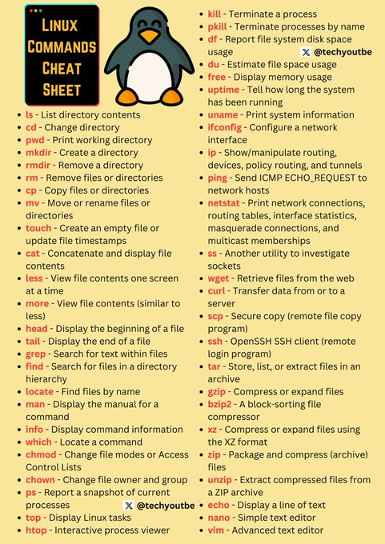

# linux_commands_cheat_sheet

**Tweet URL:** [/techyoutbe/status/1868923330809532640](/techyoutbe/status/1868923330809532640)

**Tweet Text:** Linux (Imp) Commands - Cheat Sheet 

**Image 1 Description:** The image presents a comprehensive cheat sheet for Linux commands, featuring a list of essential commands in alphabetical order. The title "Linux Commands Cheat Sheet" is prominently displayed at the top left corner, accompanied by a cartoon penguin illustration to its right.

**Key Features:**

* **Alphabetical Order:** The commands are listed in alphabetical order, making it easy for users to quickly locate and access specific commands.
* **Command Descriptions:** Each command includes a brief description of what it does, providing context and clarity for users who may not be familiar with the command's purpose.
* **Color-Coded Commands:** Certain commands are highlighted in red or blue text, potentially indicating their importance or frequency of use.

**Visual Elements:**

* **Penguin Illustration:** The cartoon penguin illustration adds a touch of whimsy to the image and serves as a visual anchor for the title.
* **Background Color:** The background features a light yellow color scheme, which provides good contrast with the text and makes it easy to read.

**Overall Impression:**

The cheat sheet appears to be well-organized and user-friendly, making it an excellent resource for Linux users who need quick access to essential commands. The inclusion of command descriptions and highlighted important commands adds value to the image, ensuring that users can quickly find what they need without having to search through lengthy documentation or tutorials.

