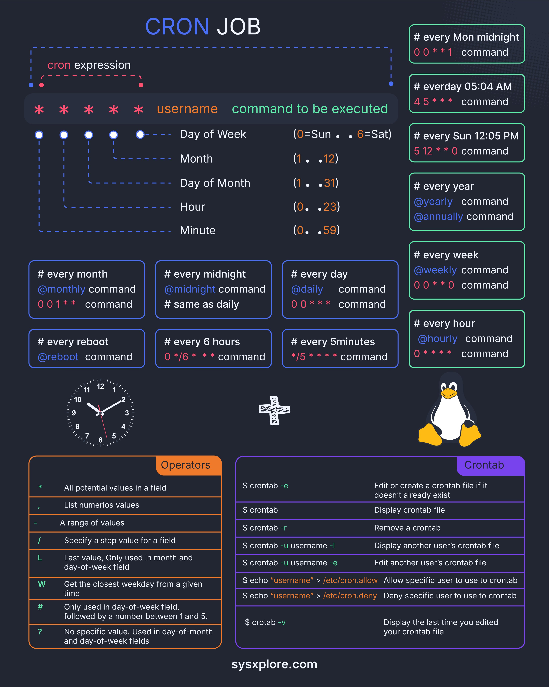

# linux_cron_jobs_tweet

**Tweet URL:** [/sysxplore/status/1875938065409257499](/sysxplore/status/1875938065409257499)

**Tweet Text:** Linux cron jobs 101

**Image 1 Description:** The infographic, titled "CRON JOB," provides a comprehensive guide to understanding CRON jobs, including their syntax, operators, and potential values for each field.

**Key Concepts:**

*   **CRON Job Syntax:** The first section explains the basic structure of a CRON job, comprising six fields (minute, hour, day of month, month, day of week, command) separated by spaces. Each field is optional, except for the last one.
    *   Minute (0-59)
        *   Syntax: `*/5` every 5 minutes
    *   Hour (0-23)
        *   Syntax: `*` every hour at midnight
    *   Day of Month (1-31)
        *   Syntax: `1` first day of the month, `3-5` third to fifth days of the month
    *   Month (1-12)
        *   Syntax: `1,2,4-9` January, February, April to September
    *   Day of Week (0-6) where 0 represents Sunday and 6 represents Saturday
        *   Syntax: `*` every day, `5` every Friday, `6` last day of the week

**Operators and Potential Values:**

*   **All Potential Values in a Field:** A range of values can be specified for each field using commas or hyphens.
    *   Example: `1-3` represents the first to third days of the month
*   **List Numeros Values:** Specific numbers can be listed without a range indicator (e.g., `2,4,6`)
*   **Range Indication:** A range indicator can be used to specify consecutive values (e.g., `1-5`, `10-15`)

**Additional Features:**

*   **Reboot Command:** The reboot command is represented by `@reboot`
*   **Crontab Files:** Crontab files are located in the `/var/cron/tabs/` directory
*   **Editing a Crontab File:** To edit a crontab file, use the `crontab -e` command

**Conclusion:**

The infographic provides a detailed overview of CRON jobs, including their syntax, operators, and potential values for each field. It also covers additional features such as reboot commands and crontab files. By following this guide, users can create complex scheduling tasks using the `cron` daemon.

