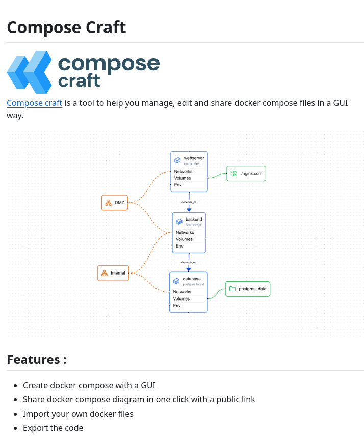

# manage_docker_compose_files

**Tweet URL:** [/tom_doerr/status/1879473911869346092](/tom_doerr/status/1879473911869346092)

**Tweet Text:** Manage Docker Compose files in a GUI

**Image 1 Description:** The image presents a visual representation of the Compose Craft tool, which is designed to assist users in managing, editing, and sharing Docker compose files in a GUI (Graphical User Interface) manner.

*   **Compose Craft Logo**
    *   The logo features three blue 3D cubes arranged in an L-shape formation.
    *   The text "compose craft" is displayed below the logo.
*   **Tagline**
    *   The tagline reads, "Compose craft is a tool to help you manage, edit and share docker compose files in a GUI way."
*   **Flowchart**
    *   The flowchart illustrates the process of creating a Docker compose file using Compose Craft.
    *   It begins with a web server and includes components such as networks, volumes, and databases.
    *   The flowchart also shows how to import existing files and export them in various formats.
*   **Features**
    *   Create docker compose with GUI
    *   Share docker compose diagram in one click with public link
    *   Import your own docker files
    *   Export the code

In summary, the image effectively communicates the purpose and functionality of Compose Craft, making it easy for users to understand how to use the tool to create, manage, and share Docker compose files.

