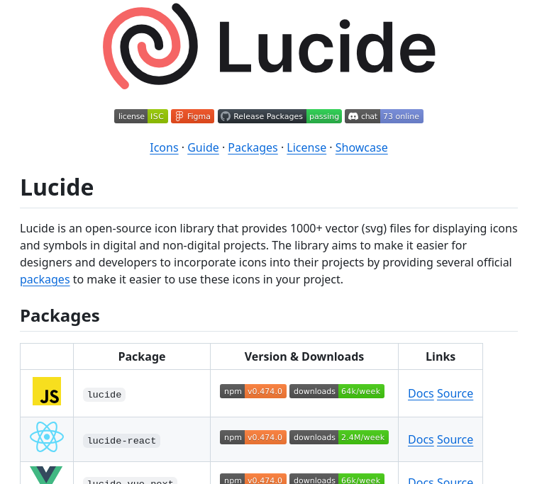

# open_source_icon_library

**Tweet URL:** [/tom_doerr/status/1886636635527278756](/tom_doerr/status/1886636635527278756)

**Tweet Text:** Open-source icon library with 1000+ SVG icons

**Image 1 Description:** The image presents a screenshot of the Lucide icon library website, showcasing its features and offerings.

* **Title**: 
	+ The title "Lucide" is prominently displayed in large black text at the top center of the page.
	+ A red swirl logo is situated to the left of the title.
* **Navigation Bar**:
	+ A navigation bar with various links is located below the title, including "license", "ISC", "Figma", "Release Packages", "passing", and "chat".
	+ The "73 online" link indicates that there are 73 icons available for download.
* **Main Content**:
	+ Below the navigation bar, a brief description of Lucide is provided, highlighting its features as an open-source icon library with over 1000 vector (svg) files for displaying icons and symbols in digital and non-digital projects.
	+ A table displays information about different packages available for download, including their names, versions, and links to download them.
* **Footer**:
	+ At the bottom of the page, a footer contains links to other pages on the website, such as "Icons", "Guide", "Packages", "License", and "Showcase".

In summary, the image showcases the Lucide icon library website, which provides an open-source collection of icons with over 1000 vector (svg) files. The website offers various packages for download, each with its own version and link to access it.

