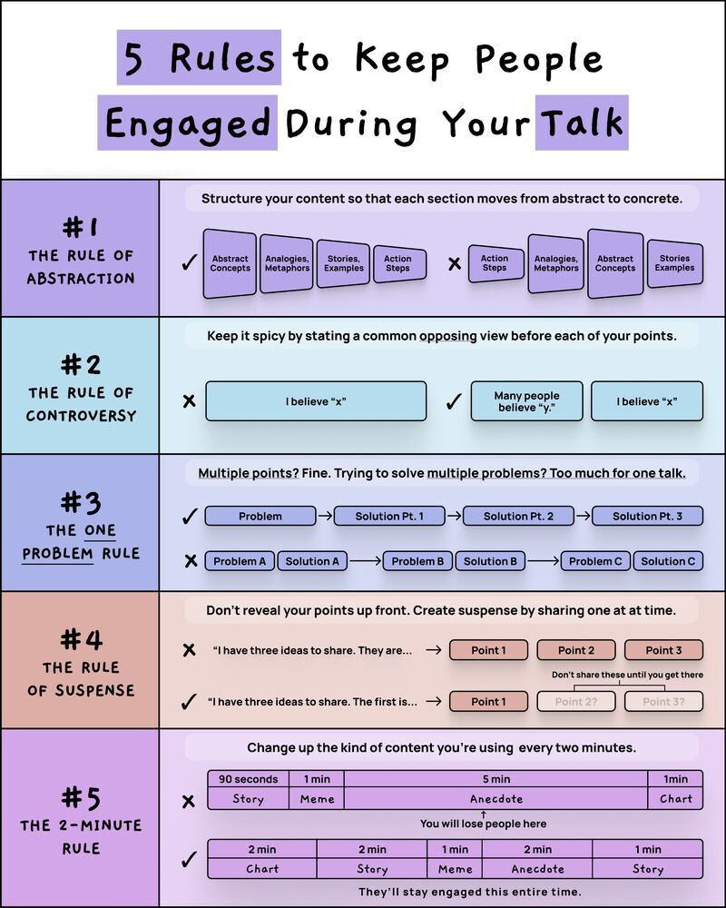

# rules_keep_people_engaged

**Tweet URL:** [/AlwaysKeepL/status/1879251639707783184](/AlwaysKeepL/status/1879251639707783184)

**Tweet Text:** 5 Rules to keep people engaged during your talk

**Image 1 Description:** The image presents a comprehensive guide to engaging audiences during talks, comprising five distinct rules that can be applied to any presentation or discussion.

*   **Rule 1: The Rule of Abstraction**
    *   This rule emphasizes the importance of structuring content in a way that facilitates easy transitions between abstract concepts and concrete examples.
    *   It suggests breaking down complex ideas into smaller, more manageable parts, using analogies, metaphors, stories, and action steps to illustrate key points.
*   **Rule 2: The Rule of Controversy**
    *   This rule encourages speakers to inject controversy into their talks by introducing opposing viewpoints before presenting their own perspective.
    *   It advises against stating a common opinion without first acknowledging alternative views.
*   **Rule 3: The One Problem Rule**
    *   This rule recommends focusing on a single problem or issue per talk, rather than attempting to address multiple problems simultaneously.
    *   By doing so, speakers can provide more in-depth analysis and solutions to the identified problem.
*   **Rule 4: The Rule of Suspense**
    *   This rule suggests creating suspense by sharing ideas gradually throughout a presentation.
    *   It advises against revealing all information at once, instead building anticipation and curiosity among listeners.
*   **Rule 5: The Two-Minute Rule**
    *   This rule provides guidelines for structuring content to maintain audience engagement over the course of two minutes.
    *   It recommends changing up the type of content used every two minutes, using a combination of storytelling techniques, including memes, anecdotes, and charts, to keep listeners interested.

In summary, these five rules offer practical advice for crafting engaging talks that captivate audiences. By incorporating abstraction, controversy, focus on a single problem, suspense-building, and varying content types, speakers can create presentations that effectively convey their message and leave a lasting impression on their audience.

