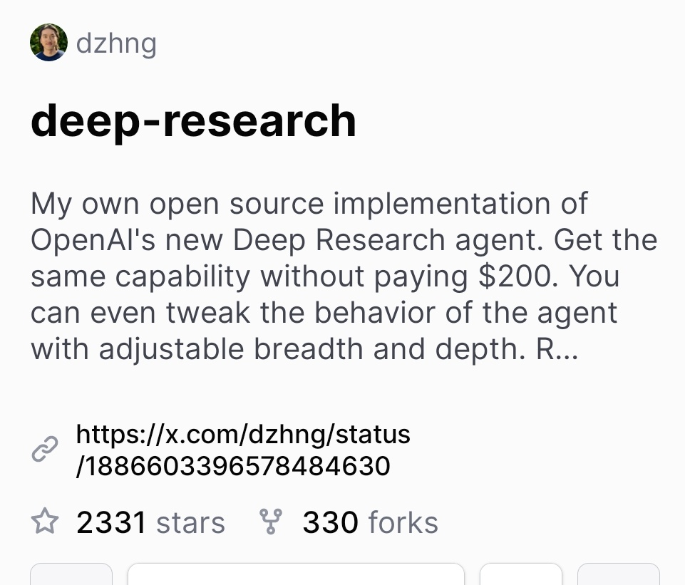

# stars_this_github_repo

**Tweet URL:** [/dzhng/status/1888299647845961909](/dzhng/status/1888299647845961909)

**Tweet Text:** 2.3k stars on this github repo in 3 days... wat 

[https://github.com/dzhng/deep-research…](https://github.com/dzhng/deep-research…)

**Image 1 Description:** The image displays a screenshot of a Reddit post about deep research in AI, with the title "deep-research" in large black text at the top.

*   The username "dzhng" is displayed in gray text above the title.
*   Below the title, there is a paragraph of text that reads: 
    *   "My own open source implementation of OpenAI's new Deep Research agent. Get the same capability without paying $200. You can even tweak the behavior of the agent with adjustable breadth and depth. R..."
*   At the bottom of the image, there are several links and statistics:
    *   A link to the post on Reddit: "https://www.reddit.com/r/DeepResearch/comments/jg3k9m/my_own_open_source_implementation_of_openais_new/"
    *   The number of stars: 2331
    *   The number of forks: 330

Overall, the image appears to be a screenshot of a Reddit post about an open-source implementation of OpenAI's new Deep Research agent. The post is written by a user named "dzhng" and has received over 2,300 stars and 330 forks.

