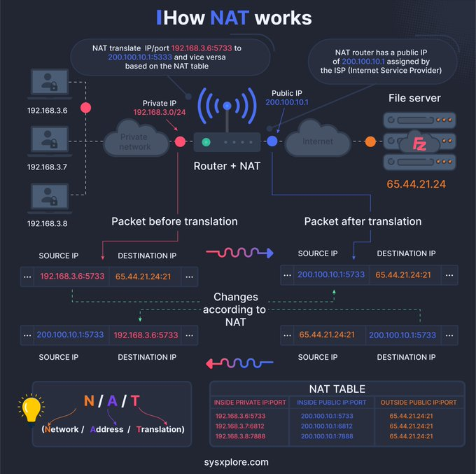

# works_tweet_text_works

**Tweet URL:** [/techyoutbe/status/1880222098234224810](/techyoutbe/status/1880222098234224810)

**Tweet Text:** How NAT works?

**Image 1 Description:** The infographic, titled "How NAT Works," provides a comprehensive overview of Network Address Translation (NAT) in computer networking. The diagram illustrates how NAT translates IP addresses to enable multiple devices on a private network to access the internet using a single public IP address.

**Key Components:**

* **Router + NAT**: A router with built-in NAT functionality.
* **Private Network**: Devices connected to the router, each assigned a unique private IP address.
* **Public Network**: The internet, accessed through a single public IP address.
* **NAT Table**: A table maintained by the router that maps private IP addresses to public IP addresses.

**How NAT Works:**

1. **Packet Creation**: A device on the private network creates a packet addressed to a destination on the public network.
2. **Router Receives Packet**: The router receives the packet and checks its destination address against the NAT table.
3. **Translation**: If a match is found, the router translates the source IP address in the packet from a private to a public IP address.
4. **Packet Forwarding**: The translated packet is then forwarded to the destination on the public network.

**Benefits of NAT:**

* **Conserves Public IP Addresses**: Allows multiple devices to share a single public IP address, conserving IP addresses.
* **Improves Security**: Hides private IP addresses from external networks, reducing the risk of unauthorized access.

In summary, the infographic effectively explains how NAT works and its benefits in computer networking. By translating IP addresses, NAT enables multiple devices on a private network to access the internet using a single public IP address, conserving IP addresses and improving security.

