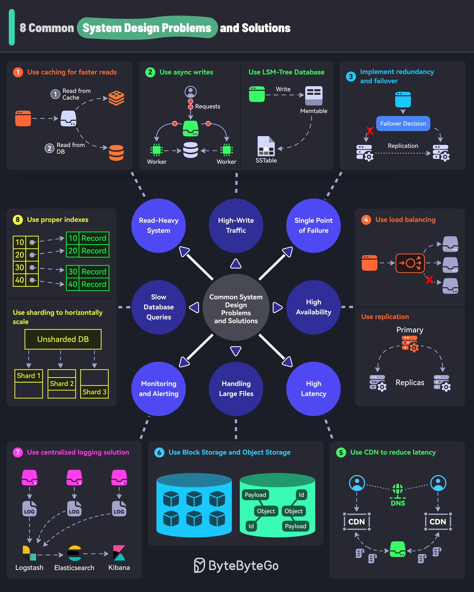

# solve_common_system_design

**Tweet URL:** [/sahnlam/status/1869613641097756741](/sahnlam/status/1869613641097756741)

**Tweet Text:** How to Solve Common System Design Challenges

**Image 1 Description:** The infographic, titled "8 Common System Design Problems and Solutions," presents a comprehensive overview of eight common system design issues and their corresponding solutions. The title is prominently displayed in white text within a green bubble at the top left corner of the image.

**Eight Common System Design Problems:**

*   **Use caching for faster reads**
    *   Problem: Slow data retrieval
    *   Solution: Implement caching mechanisms to improve read performance
*   **Use async writes**
    *   Problem: Slow write performance
    *   Solution: Utilize asynchronous writing techniques to enhance write speed
*   **Implement redundancy and failover**
    *   Problem: System downtime due to hardware failures
    *   Solution: Implement redundant systems and failover mechanisms to ensure high availability
*   **Use load balancing**
    *   Problem: Uneven distribution of workload across servers
    *   Solution: Utilize load balancing techniques to distribute workload evenly across servers
*   **Use replication**
    *   Problem: Data loss due to hardware failures
    *   Solution: Implement data replication mechanisms to ensure data integrity and availability
*   **Use centralized logging solution**
    *   Problem: Difficulty in monitoring system logs
    *   Solution: Utilize a centralized logging solution to simplify log management and analysis
*   **Use horizontal sharding**
    *   Problem: Scalability issues due to increasing data volume
    *   Solution: Implement horizontal sharding techniques to distribute data across multiple servers
*   **Use vertical sharding**
    *   Problem: Difficulty in handling large datasets
    *   Solution: Utilize vertical sharding techniques to split large datasets into smaller, more manageable pieces

**Common System Design Issues and Solutions:**

The infographic also highlights eight common system design issues and their corresponding solutions:

*   **Read-heavy system**: Implement caching mechanisms to improve read performance
*   **High-write traffic**: Utilize asynchronous writing techniques to enhance write speed
*   **Single point of failure**: Implement redundant systems and failover mechanisms to ensure high availability
*   **Slow database queries**: Optimize database queries to reduce latency
*   **Monitoring and alerting**: Implement monitoring and alerting tools to detect issues promptly
*   **Handling large files**: Utilize distributed file storage solutions to handle large files efficiently
*   **Block storage and object storage**: Implement block storage and object storage solutions to improve data access and management

In summary, the infographic provides a comprehensive overview of eight common system design problems and their corresponding solutions. By implementing these solutions, organizations can improve the performance, scalability, and reliability of their systems.

