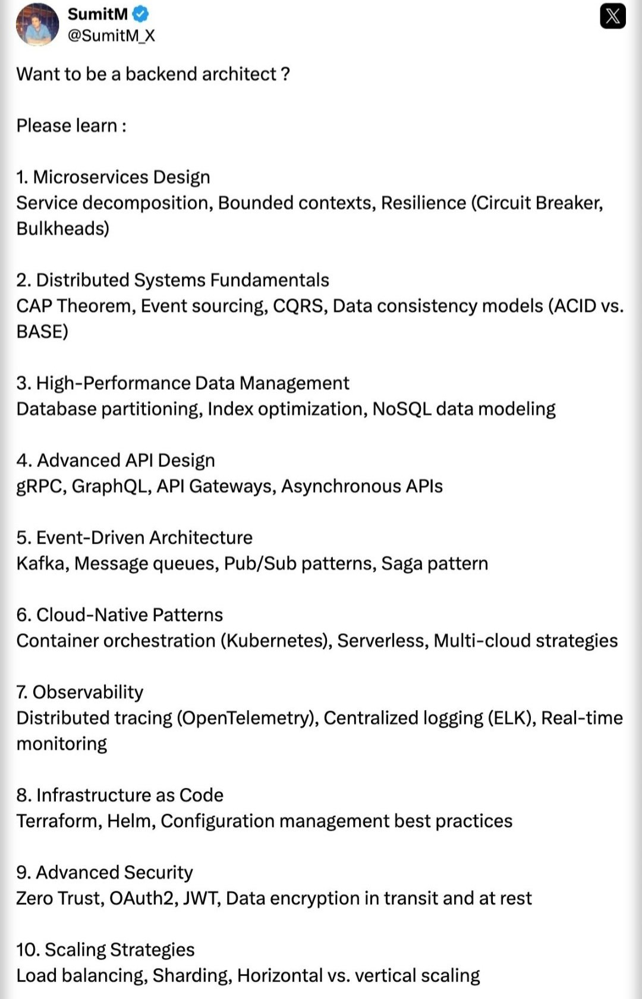

# want_backend_architect_please

**Tweet URL:** [/SumitM_X/status/1885379904188866994](/SumitM_X/status/1885379904188866994)

**Tweet Text:** Want to be a backend architect?

Please learn 

**Image 1 Description:** The image displays a Twitter post from Sumit M, who is asking for advice on how to become a backend architect. 

*   The tweet includes a list of 10 items that are relevant to becoming a backend architect.
    *   Microservices Design
        *   Service decomposition
        *   Bounded contexts
        *   Resilience (circuit breaker, bulkheads)
    *   Distributed Systems Fundamentals
        *   CAP theorem
        *   Event sourcing
        *   Consistency models (ACID vs BASE)
    *   High-Performance Data Management
        *   Database partitioning
        *   Index optimization
        *   NoSQL data modeling
    *   Advanced AI Design
        *   gRPC
        *   GraphQL
        *   API gateways
        *   Asynchronous APIs
    *   Event-Driven Architecture
        *   Kafka
        *   Message queues
        *   Pub/Sub patterns
        *   Saga pattern
    *   Cloud-Native Patterns
        *   Container orchestration (Kubernetes)
        *   Serverless computing
        *   Multi-cloud strategies
    *   Observability
        *   Distributed tracing (OpenTelemetry)
        *   Centralized logging (ELK)
        *   Real-time monitoring
    *   Infrastructure as Code
        *   Terraform
        *   Helm
        *   Configuration management best practices
    *   Advanced Security
        *   Zero Trust architecture
        *   OAuth2
        *   JWT
        *   Data encryption in transit and at rest
    *   Scaling Strategies
        *   Load balancing
        *   Sharding
        *   Horizontal vs vertical scaling

Overall, the tweet provides a comprehensive list of skills and knowledge areas that are relevant to becoming a backend architect.

