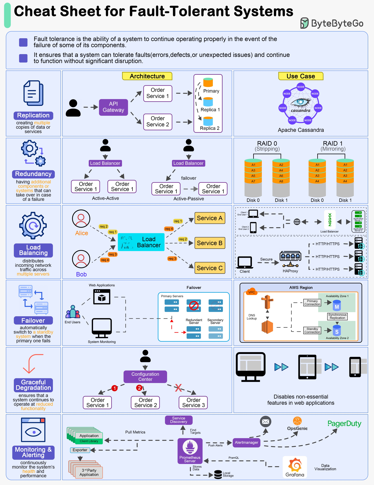

# build_fault_tolerant_systems

**Tweet URL:** [/sahnlam/status/1876496495358456111](/sahnlam/status/1876496495358456111)

**Tweet Text:** How to Build Fault-Tolerant Systems

**Image 1 Description:** The image presents a comprehensive "Cheat Sheet for Fault-Tolerant Systems," which provides an overview of various concepts related to fault tolerance in software systems. The cheat sheet is organized into multiple sections, each focusing on different aspects of fault-tolerance.

* **Replication**
	+ Definition: Creating multiple copies of data or services
	+ Purpose: Ensures that if one instance fails, others can continue operating without interruption
	+ Example: Database replication ensures data consistency across multiple servers
* **Redundancy**
	+ Definition: Having additional components or systems that can take over in case of a failure
	+ Purpose: Reduces the risk of system downtime by providing an alternative path for processing
	+ Example: Load balancers distribute incoming traffic across multiple web servers to prevent overload on any single server
* **Load Balancing**
	+ Definition: Distributes incoming network traffic across multiple servers to improve responsiveness and reliability
	+ Purpose: Ensures that no single server becomes overwhelmed, leading to poor performance or failure
	+ Example: Apache HTTP Server uses load balancing to distribute traffic across multiple web servers
* **Failover**
	+ Definition: Automatically switching to a standby system when the primary one fails
	+ Purpose: Minimizes downtime and ensures continuous operation
	+ Example: Database failover ensures that data remains available even if the primary database instance fails
* **Graceful Degradation**
	+ Definition: Ensuring that a system continues to operate at reduced functionality when faced with errors or defects
	+ Purpose: Maintains availability while minimizing impact on users
	+ Example: Web applications may continue to display basic content but limit advanced features during maintenance or upgrades
* **Monitoring & Alerting**
	+ Definition: Continuously monitoring the system's health and alerting teams of potential issues
	+ Purpose: Detects problems early, allowing for prompt resolution before they impact users
	+ Example: Prometheus Server monitors system metrics and alerts developers when thresholds are exceeded
* **API Gateway**
	+ Definition: A single entry point for all incoming requests to the API
	+ Purpose: Simplifies security configurations, rate limiting, and traffic management
	+ Example: NGINX acts as an API gateway by routing requests to various backend services
* **Service Discovery**
	+ Definition: Dynamically locating available instances of a service
	+ Purpose: Ensures that clients can connect to the most suitable instance based on factors like load or proximity
	+ Example: Netflix's Eureka service discovery platform helps maintain availability and scalability

In summary, the "Cheat Sheet for Fault-Tolerant Systems" provides an overview of key concepts in fault-tolerance, including replication, redundancy, load balancing, failover, graceful degradation, monitoring & alerting, API gateways, and service discovery. These concepts are essential for designing robust software systems that can withstand failures and ensure continuous operation.

