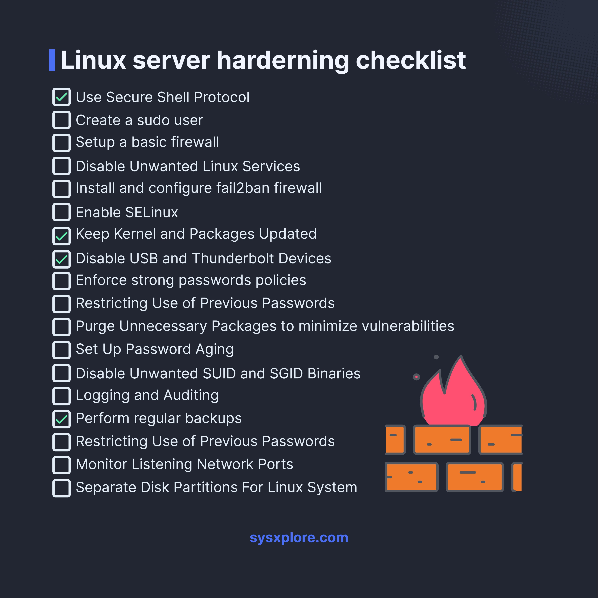

# linux_server_hardening_checkli

**Tweet URL:** [/sysxplore/status/1886052013386944616](/sysxplore/status/1886052013386944616)

**Tweet Text:** Linux server hardening checklist

**Image 1 Description:** The image presents a comprehensive checklist for hardening Linux servers, featuring a list of 20 tasks with accompanying checkboxes to track progress. The title "Linux server hardening checklist" is prominently displayed at the top.

**Key Features:**

* **Checklist:** A total of 20 tasks are listed, each accompanied by a checkbox to mark completion.
* **Title:** The title "Linux server hardening checklist" is clearly visible at the top of the image.
* **Source:** A URL, sysxplore.com, is provided at the bottom of the image, indicating the source of the checklist.

**Tasks:**

The tasks included in the checklist cover a range of security-related topics, such as:

* **Firewall configuration**
* **Password management**
* **User account management**
* **File system security**
* **Network security**

Each task is concise and easy to understand, making it simple for users to follow along.

**Visual Elements:**

The image features a clean and modern design, with a dark blue background that provides good contrast for the white text. The use of checkboxes adds a touch of interactivity to the checklist, allowing users to mark their progress as they complete each task.

**Overall:**

This Linux server hardening checklist is an essential resource for anyone looking to secure their servers and protect against potential threats. By following this comprehensive guide, users can ensure that their systems are properly configured and up-to-date with the latest security patches.

