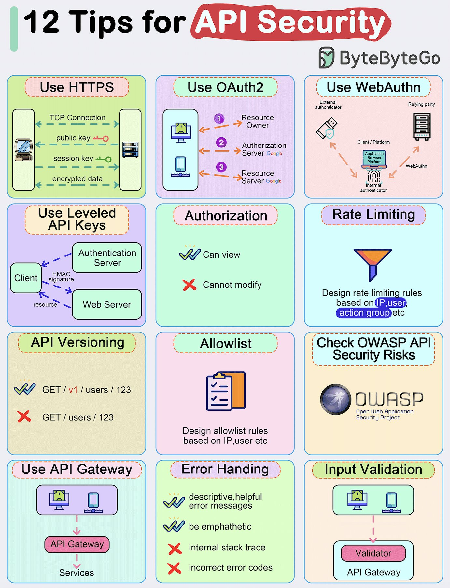

# tips_security_https_oauth2

**Tweet URL:** [/bytebytego/status/1884479345584136603](/bytebytego/status/1884479345584136603)

**Tweet Text:** Top 12 Tips for API Security 

- Use HTTPS 
- Use OAuth2 
- Use WebAuthn 
- Use Leveled API Keys 
- Authorization 
- Rate Limiting 
- API Versioning 
- Whitelisting 
- Check OWASP API Security Risks 
- Use API Gateway 
- Error Handling 
- Input Validation 

--
Subscribe to our weekly newsletter to get a Free System Design PDF (158 pages): [https://bit.ly/bbg-social](https://bit.ly/bbg-social)

**Image 1 Description:** Error in processing image

